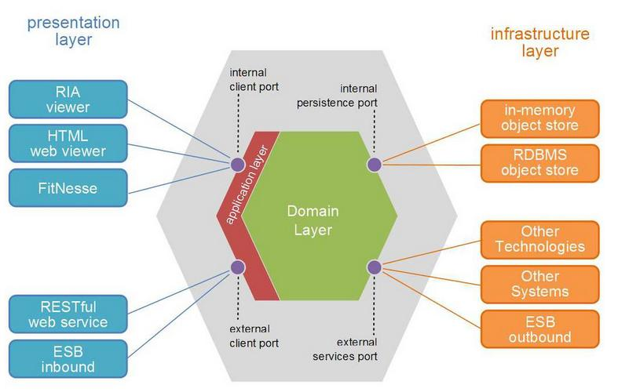

# TP MIAGE conception logicielle

NOTE: TP de deux slots de 1h20

## Nom du(des) étudiant(e)(s) de ce monôme/binôme 
WARNING: NE PAS OUBLIER DE MENTIONNER LES DEUX NOMS SI VOUS ETES EN BINOME!

#Priscilla Bouron
#Alexandre Cellier
#Matthias Meunier

Commentaires éventuels des étudiants : #XXXXXX#

## Pré-requis 

* Disposer d'un PC d'au moins 6 Gio de RAM avec 20 Gio de disque disponible ;
* Disposer d'une version recente de VirtualBox ;
* Disposer d'un compte Github par personne (ou un pour deux personnes si vous êtes en binôme) ;
* Télécharger et décompresser l'image VirtualBox de l'environnement de développement https://public.florat.net/cours_miage/vm-tp-miage.zip[ici] (à faire *avant le TP*). Le login/mot de passe est : `tp`/`tp`.

## Déroulement du TP

*Répondre aux questions de la feuille de TP juste sous la question* (en modifiant, commitant puis poussant le fichier `README.adoc`).

Nous fournissons différents projets Eclipse servant de base de travail aux exercices suivant. Cela permet un point de synchronisation de tous les étudiants à différents moments du TP. 

TIP: Fermer chaque projet Eclipse (sans supprimer les sources) avant de passer à l'exercice suivant pour éviter de confondre les projets ex1 et ex2.


### Exercice 1 - Etudier une API REST sans couches
_Temps estimé : 40 mins_

* Importer dans Eclipse les projets `todolist-debut-ex1` et `todolist-debut-ex2`.

Faire `File` -> `Import` -> `Projects from Git (with smart import)` -> `Clone URI` -> URI: `https://github.com/<x>/tp1-miage-2021.git` (conserver les autres options inchangées) -> 'Import projects from File System or Archives' : ne laisser cocher que `tp1-miage-2021/tolist-debut-ex1` et `tp1-miage-2021/tolist-debut-ex2` ('import as Maven') -> Bouton 'Finish'.

TIP: [Rappel Git] Trois dépôts sont ici utilisés: le dépot Github de l'enseignant (`bflorat/tp1-miage-2021`), le dépot Github du binôme (`<x>/tp1-miage-2021`), le dépot local sur le portable de l'un ou des deux étudiants du binôme.


* Observer le code du projet `todolist-debut-ex1`

*Le code est-il structuré en couches ? Quel problèmes ce code peut-il poser ?*

*Réponse :*
* Non le code n'est-structuré en couches malgré qu'il y ai un controlleur et un DAO. Ce n'est pas suffisant car toutes les sources sont dans le même package. Les problèmes de ne pas avoir de couches sont que le maintient de l'application est beaucoup plus compliqué ainsi que la modulabilité. De plus, les tests sont quasiment impossible avec un code qui n'est pas structuré. *

*Où se trouve le code métier (voir la règle de gestion RG 1) ?*

*Réponse :*
* Le code métier ce trouve dans le controlleur : "TodoListController.java". *

*Cette règle est-elle facilement testable par un test unitaire ?*

*Réponse*
* Non cette règle n'est pas facilement à cause de la classe Instant. Le test unitaire ne fonctionnera pas toujours par exemple si à l'instant T, on initialise le parametre de la fonction dans le test unitaire avec une date dans une semaine. A l'instant T ça retournera TRUE et dans deux semaines ça retournera FALSE. Un test unitaireire est cense fonctionner tout le temps sans etre modifier. Pour resoudre ce probleme il faudrait faire un MOCK d'une class statique ce n'est pas une chose facile. *

* Lancer une base PostgreSQL en Docker dans un terminal (on lance ici la base en mode interactif pour visualiser son activité. Pour la lancer en tâche de fond, remplacer les options `it` par `d` comme 'daemon'):
```bash
docker run -it -e POSTGRES_PASSWORD=password -p 5432:5432 postgres
```
*Expliquer cette ligne de commande (y compris les options utilisées)*

*Réponse*
* Cette ligne de commande permet de lancer Docker.*
* Le parametre "-it" sert à interagir avec le conteneur. *
* Le parametre "-e" permet de crée une variables d'environnement. *
* Le parametre "POSTGRES_PASSWORD" permet de renseigner le mot de passe de la base postgres. *
* Le parametre "-p" sert à spécifier le port. *

* Compléter le code manquant dans la méthode `TodoListController.createTodoItem()`

*Pourquoi `todoItemRepository` est-il `null` ? Quelle est la meilleure façon de l'injecter ?*

*Réponse*
* Le fichier `todoItemRepository` est 'null' car il n'a pas été gerer par SPRING. Il faut l'injecter avec SPRING. Pour cela il faut ajouter un '@Named' devant la class en question. Ensuite, il faut ajouter un '@Injected' aux endroits ou l'on souhaite l'utiliser. *

* Modifier le code en conséquence.

* Tester vos endpoints avec un client REST.


[NOTE]
====
* Les URL des endpoints sont renseignées dans le contrôleur via les annotation `@...Mapping` 
* Exemple de body JSON : 

```json
{
    "id": "0f8-06eb17ba8d34",
    "time": "2020-02-27T10:31:43Z",
    "content": "Faire les courses"
  }
```
====

NOTE: Pour lancer l'application Spring, selectionner la classe `TodolistApplication` et faire bouton droit -> 'Run as' -> 'Java Application'.

* Quand les deux endpoints fonctionnent, commiter, faire un push vers Github et fermer le projet Eclipse (ne pas le supprimer).

* Vérifier avec DBeaver que les donnnées sont bien en base PostgreSQL.

### Exercice 2 - Refactoring en architecture hexagonale
_Temps estimé : 1 h 20_

* Partir du projet `todolist-debut-ex2`

NOTE: Le projet a été réusiné suivant les principes de l'architecture hexagonale : 


Source : http://leanpub.com/get-your-hands-dirty-on-clean-architecture[Tom Hombergs]

* Nous avons découpé le coeur en deux couches : 
  - la couche `application` qui contient tous les contrats : ports (interfaces) et les implémentations des ports d'entrée (ou "use case") et qui servent à orchestrer les entités.
  - la couche `domain` qui contient les entités (au sens DDD, pas au sens JPA). En général des classes complexes (méthodes riches, relations entre les entités)

*Rappeler en quelques lignes les grands principes de l'architecture hexagonale.*

*Réponse*
* L'architecture hexagonale est conçu autour d'une logique métier afin d'eviter les problèmes liés à un développement technique (Architecture en couches). Toute l'architecture gravite autour d'un domaine qui s'occupe de tous les traitements liés au metier. Il contient des ports "in" et "out" qui permettent adapteurs de communiquer avec lui. Les adapteurs s'occupent de la partie technique.  *

Compléter ce code avec une fonctionnalité de création de `TodoItem`  persisté en base et appelé depuis un endpoint REST `POST /todos` qui :

* prend un `TodoItem` au format JSON dans le body (voir exemple de contenu plus haut);
* renvoie un code `201` en cas de succès. 

La fonctionnalité à implémenter est contractualisée par le port d'entrée `AddTodoItem`.

### Exercice 3 - Ecriture de tests
_Temps estimé : 20 mins_

* Rester sur le même code que l'exercice 2

* Implémenter (en junit) des TU sur la règle de gestion qui consiste à afficher `[LATE!]` dans la description d'un item en retard de plus de 24h.

*Quels types de tests devra-t-on écrire pour les adapteurs ?* 

*Réponse*
* Démarrer tout spring pour faire test integration*

*Que teste-on dans ce cas ?*

*Réponse*
* Que tous les modules communiquent bien entre eux. *

*S'il vous reste du temps, écrire quelques uns de ces types de test.*

[TIP]
=====
- Pour tester l'adapter REST, utiliser l'annotation `@WebMvcTest(controllers = TodoListController.class)`
- Voir cette https://spring.io/guides/gs/testing-web/[documentation]
=====
